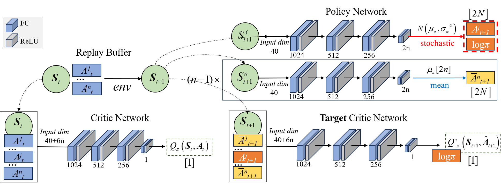
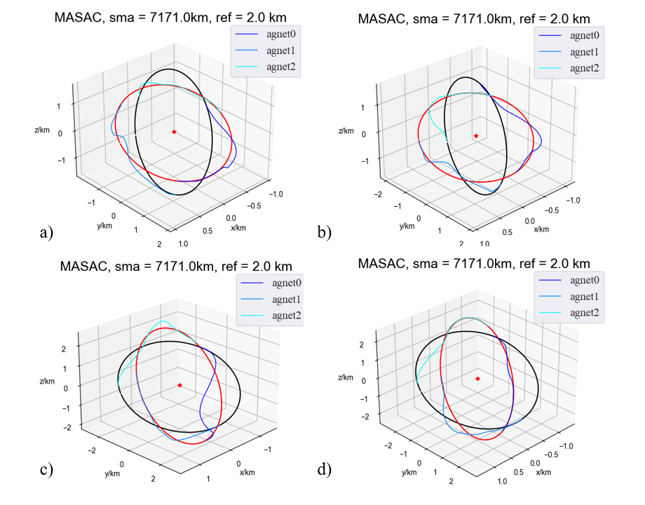

# Cooperative Formation Control Using Reinforcement Learning in Astronomical Satellites

This paper addresses the demands of astronomical observation satellites by employing **Soft Actor-Critic (SAC)** to obtain formation control policies for multi-satellites (agents) with continuous action spaces. SAC maximizes a value function that includes an entropy reward, balancing exploration and exploitation.

For the cooperative formation reconfiguration mission, we introduced a newly established action and observation space specifically designed for multi-agent systems. Based on this, we designed a multi-agent communication mechanism and developed **Multi-Agent SAC (MASAC)** for cooperative environments. Furthermore, we enhanced formation scalability by developing a fully shared policy MASAC.

Compared to state-of-the-art methods such as **MADDPG**, our approach significantly increased training success rates while reducing training time to just 40% of these methods.

Additionally, focusing on multi-agent interferometric baseline stability in astronomical interferometry and communication maintenance under payload constraints, a training environment for three-agent and multi-agent systems was established. Agents were trained and tested within this environment.

Finally, the performance of the proposed DRL methods was analyzed. Compared to traditional **MPC** methods, the average decision-making time for formation control was reduced by 95%, and fuel consumption decreased by 7%. This provides a roadmap for intelligent satellite formations in the future.

formation flying

